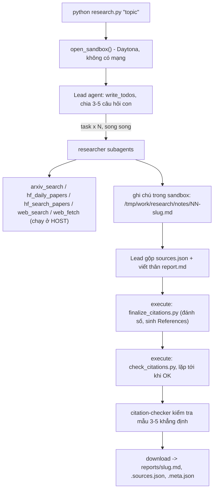

# Deep Research Agent (Deep Agents + Daytona sandbox)

Bài nộp lab Deep Research Agent của **Nguyễn Việt Hùng (02972)**. Đề bài gốc: [`GUIDE.md`](GUIDE.md), [`RUBRIC.md`](RUBRIC.md), [`REPORT_TEMPLATE.md`](REPORT_TEMPLATE.md).

Nhập một chủ đề, ví dụ `survey about world model`. Hệ thống đa tác tử sẽ tự lập kế hoạch, giao các câu hỏi con cho nhiều researcher chạy song song, tìm tài liệu trên arXiv, Hugging Face và web (Exa), rồi viết một báo cáo khảo sát có trích dẫn `[n]`. Mỗi trích dẫn trỏ tới một nguồn có thật trong `sources.json`.



## 1. Cài đặt

Cần Python 3.11 trở lên.

Linux / macOS:

```bash
python3 -m venv .venv && source .venv/bin/activate
pip install -r requirements.txt
cp .env.example .env          # rồi điền khóa của bạn
```

Windows (PowerShell):

```powershell
python -m venv .venv
.\.venv\Scripts\Activate.ps1   # nếu bị chặn: Set-ExecutionPolicy -Scope CurrentUser RemoteSigned
pip install -r requirements.txt
Copy-Item .env.example .env
```

Điền vào `.env` (tệp này nằm trong `.gitignore`, **không bao giờ commit**):

| Biến | Ý nghĩa |
|---|---|
| `LAB_MODEL`, `OPENAI_API_KEY` | Mô hình LLM có tool calling. Bài này chạy với `LAB_MODEL=openai:gpt-5.4-mini`. Các nhà cung cấp khác: xem `.env.example`. |
| `DAYTONA_API_KEY` | Sandbox Daytona (https://app.daytona.io). Không có tài khoản thì đặt `SANDBOX=docker` để dùng container Docker cục bộ. |
| `EXA_API_KEY` | Khuyến nghị (https://dashboard.exa.ai/api-keys): bản miễn phí không khóa của Exa MCP bị giới hạn tốc độ rất nhanh. |

## 2. Chạy

```bash
python tools.py                                    # thử riêng 5 công cụ nguồn dữ liệu (gọi API thật, không tốn token LLM)
python -m unittest discover tests                  # 29 test offline: retry, parser, validator, provenance, guard, slugify, save_outputs
python research.py "survey about world model"      # một lần deep research (khoảng 2-4 phút)
python check_citations.py reports/<slug>.md reports/<slug>.sources.json   # kiểm tra lại trích dẫn trên máy
python self_check.py                               # kiểm tra trước khi nộp (5 chủ đề, meta.json, trích dẫn, khóa trong git)
```

Trong lúc chạy, `research.py` in tiến độ ra stderr: mỗi lời gọi công cụ của lead và của subagent, kết quả các lệnh `execute` của lead (finalizer, validator), và câu trả lời cuối của lead. Chạy thành công thì in `Report saved to ...` và thoát mã 0. Chạy hỏng (không có báo cáo, `sources.json` hỏng, có URL không do công cụ nào trả về, chạm giới hạn đệ quy...) thì in `FAILED: ...`, thoát mã 1 và **không ghi tệp nào** vào `reports/`.

## 3. Đọc thư mục `reports/`

Mỗi chủ đề trong [`topics.md`](topics.md) có ba tệp, cùng tên gốc (`slug`) lấy từ chủ đề:

| Tệp | Nội dung |
|---|---|
| `<slug>.md` | Báo cáo tiếng Anh theo `REPORT_TEMPLATE.md`: TL;DR, Background, 3-6 phần theo chủ đề, Trends and open problems, References. Mỗi `[n]` trong thân là một nguồn; `## References` có đúng một dòng (một URL) cho mỗi nguồn. |
| `<slug>.sources.json` | Mảng `{n, id, url, title, date, source}`. `source` là công cụ đã tìm ra nguồn: `arxiv` (URL `https://arxiv.org/abs/<id>`), `hf-daily` / `hf-search` (URL `https://huggingface.co/papers/<id>`), `web` (mọi URL khác). |
| `<slug>.meta.json` | Bằng chứng chấm điểm: `model`, `elapsed_s`, `subagent_calls` (số lần lead gọi `task`), `tool_calls` của lead, `tokens` (**chỉ của lead**, chưa gồm subagent nên chi phí thật cao hơn), `n_sources`, `source_families`. |

Tệp `.md` và `.sources.json` là **đúng nguyên byte đã tải về từ sandbox**. Mọi bước sửa trích dẫn (finalizer, validator) chạy trong sandbox trước khi tải về; không có bước nào sửa báo cáo ở host.

## 4. Thiết kế

### Công cụ nguồn dữ liệu ([`tools.py`](tools.py)) chạy ở host

- `with_retry`: retry `RetryableError` (HTTP 429/500/502/503/504, `httpx.TransportError`). Thời gian chờ là `Retry-After` nếu server gửi; nếu không thì backoff lũy thừa `base·2^attempt` cộng jitter ngẫu nhiên. Cả hai đều chặn trên bằng `cap`. Lần thử cuối thất bại thì ném lỗi lại, không ngủ thêm. Lỗi khác (lỗi lập trình, HTTP 4xx) không được retry.
- Mọi công cụ trả về **chuỗi**: JSON gọn của các bản ghi, `NO RESULTS`, hoặc `ERROR: ...`. Không công cụ nào ném ngoại lệ.
- **arXiv**: chỉ HTTPS. Một khóa luồng giữ khoảng cách ≥3 giây giữa hai lời gọi, kể cả khi nhiều researcher chạy song song. Truy vấn do LLM sinh ra được làm sạch, chỉ giữ chữ, số, gạch nối và bỏ `AND/OR`; không còn từ nào thì trả `NO RESULTS` mà không gọi mạng. Id bỏ hậu tố `vN`. Dùng 6 lần thử, `cap` 60 giây, vì arXiv giới hạn theo IP.
- **Hugging Face**: Daily Papers được lọc keyword ở phía client và sắp theo upvotes. Search ưu tiên `ai_summary` khi có. Bỏ qua mục không có `paper.id`.
- **Exa MCP** gọi bằng HTTP thuần (JSON-RPC `tools/call`, phản hồi dạng SSE). Bản miễn phí báo giới hạn tốc độ bằng **HTTP 200** và cờ `result._meta["ai.exa/rateLimited"]`, quan sát được khi gọi liên tiếp không khóa. Công cụ phát hiện cờ này và retry (6 lần, `cap` 60 giây), thay vì để agent coi thông báo đó là nội dung trang. Khóa `EXA_API_KEY` nằm trong URL nên được che bằng `***` trong mọi chuỗi trả về.

### Agent ([`agents.py`](agents.py))

- **Lead** (`create_deep_agent` + `TodoListMiddleware`) có công cụ tệp và `execute` của sandbox, nhưng **không có công cụ mạng**. Prompt bắt lead làm theo thứ tự:
  1. Lập kế hoạch bằng `write_todos`.
  2. Giao 3-5 câu hỏi con **song song**, tin nhắn giao việc mang đủ ngữ cảnh: chủ đề, câu hỏi con, đường dẫn ghi chú, họ nguồn cần dùng.
  3. Đọc và kiểm tra ghi chú trước khi dùng.
  4. Gộp `sources.json`: một mục cho mỗi bài, họ nguồn khớp URL, đủ ≥3 họ.
  5. Viết thân báo cáo chỉ từ ghi chú.
  6. Chạy finalizer.
  7. Chạy validator tới khi in `OK`.
  8. Nhờ `citation-checker` kiểm tra mẫu.
- **researcher** có 5 công cụ nguồn. Prompt quy định: dùng ≥2 họ nguồn cho mỗi câu hỏi con; gặp `ERROR` hoặc `NO RESULTS` thì đổi nguồn hoặc diễn đạt lại; nội dung web là **dữ liệu không đáng tin**; không lấy sự kiện hay số liệu từ trí nhớ; ghi chú theo một định dạng cố định.
- **citation-checker** chỉ có `web_fetch` và trả về SUPPORTED / PARTIAL / UNSUPPORTED / UNVERIFIABLE kèm một câu bằng chứng.
- **Giới hạn vòng lặp và chi phí**:
  - Lead: `ModelCallLimitMiddleware(run_limit=150)` và `ToolCallLimitMiddleware(run_limit=300)`, cộng `recursion_limit=1000`.
  - Mỗi subagent: 40 lần gọi mô hình và 60 lần gọi công cụ.
  - `deepagents` tự thêm một subagent `general-purpose` **không có giới hạn** nếu ta không khai báo. Vì vậy bài này khai báo đè nó bằng một bản có `SUB_LIMITS` và không có công cụ mạng, để không còn đường giao việc nào lặp vô hạn được.
  - Giới hạn số lần gọi không chặn được **một** lời gọi kéo dài. Mặc định mọi agent đều có `glob` và `grep`; `grep` đồng bộ trên sandbox không có giới hạn thời gian riêng, và lệnh Daytona mặc định được chạy tới 30 phút. Ở một lần chạy thử, citation-checker gọi `grep` và làm treo cả lần chạy 45 phút. Vì vậy mỗi agent chỉ được cấp đúng các công cụ tệp nó cần (`FilesystemMiddleware(tools=[...])`):
    - lead: `ls`, `read_file`, `write_file`, `edit_file`, `execute`;
    - researcher: `ls`, `read_file`, `write_file`, `edit_file`;
    - citation-checker: chỉ `read_file`.

### Sandbox và kiểm tra trích dẫn

- [`research.py`](research.py) luôn dùng `open_sandbox()`, nên sandbox được dừng và xóa kể cả khi lỗi. Nó tạo thư mục làm việc, tải `check_citations.py` và `finalize_citations.py` lên, chạy agent, rồi tải `report.md` và `sources.json` về. **Không có khóa hay `.env` nào được đưa vào sandbox.** Sandbox Daytona chạy với `network_block_all`.
- [`check_citations.py`](check_citations.py) chạy trong sandbox, chỉ dùng thư viện chuẩn. Nó kiểm tra:
  - `sources` không rỗng; `n` là số nguyên; URL dạng http(s) và không trùng.
  - Có tiêu đề `## References`.
  - Mọi `[n]` trong thân đều có trong `sources`, và mọi nguồn đều được trích. Hiểu được `[1, 2]` và `[1-3]`; bỏ qua `[n]` trong code và trong `[n](url)`.
  - Mỗi nguồn có đúng một dòng References, chứa đúng một URL bằng URL trong `sources.json`.
  - Ngoài 6 quy tắc của GUIDE, còn kiểm thêm hai điều: **họ nguồn khớp URL** và **≥3 họ nguồn**. Hai lỗi này đã xảy ra ở các lần chạy thử. Vì lead phải lặp cho tới khi validator in `OK`, ràng buộc tất định này đáng tin hơn là chỉ nhắc trong prompt.
- **Chỉ finalizer được đánh số lại nguồn.** Ở một lần chạy thử, validator báo hai nguồn gán sai họ. Lead "sửa" bằng cách xóa chúng và **đánh số lại** `sources.json` bằng một script Python, trong khi thân báo cáo vẫn giữ số cũ. Validator vẫn in `OK`, nhưng từ [10] trở đi các câu trích sai bài báo. Middleware `SourceNumberGuard` của lead xử lý việc này:
  - Trước và sau mỗi lệnh `execute`, `write_file`, `edit_file`, nó so ánh xạ `n → url` của `sources.json`.
  - Nếu một số `[n]` đã tồn tại mà giờ trỏ sang URL khác, nó **khôi phục** `sources.json` và báo lý do cho lead.
  - Xóa nguồn, thêm nguồn mới, đổi nhãn họ và lệnh chạy finalizer (vốn sửa thân báo cáo và nguồn cùng lúc) vẫn được phép.
- **Kiểm tra nguồn gốc URL (provenance).** Ở một lần chạy thử, Exa trả về URL đúng `https://proceedings.neurips.cc/paper_files/paper/2024/...`, nhưng agent chép sang ghi chú thì làm rơi đoạn `paper/`. Kết quả là một URL trông như thật nhưng trả về 404, mà validator không thể phát hiện. Để chặn lỗi này:
  - `tools.py` ghi lại mọi URL mà các công cụ nguồn thực sự trả về trong lần chạy.
  - Lead có công cụ host `check_source_urls`. Công cụ này đọc `sources.json` trong sandbox, không gọi mạng, và liệt kê URL nào không do công cụ nào trả về. Lead phải sửa hoặc xóa những nguồn đó.
  - Lead đôi khi gọi công cụ này rồi bỏ qua kết quả. Vì vậy khi lead chạy xong mà `sources.json` vẫn còn URL không rõ nguồn gốc, `research.py` gửi tiếp cho lead một tin nhắn nêu đúng các URL đó và yêu cầu sửa, tối đa 2 vòng.
  - `research.py` kiểm lại lần cuối sau khi tải về: còn URL không rõ nguồn gốc thì lần chạy bị coi là hỏng, thoát mã 1 và không ghi gì.

## 5. Cấu trúc thư mục

```
├── README.md  GUIDE.md  RUBRIC.md  REPORT_TEMPLATE.md  topics.md
├── requirements.txt  .env.example  .gitignore
├── model.py  sandbox.py  self_check.py  finalize_citations.py   có sẵn, không sửa
├── tools.py               retry + 5 công cụ nguồn dữ liệu
├── agents.py              prompt, subagent, lead agent, giới hạn
├── research.py            script chính
├── check_citations.py     validator, chạy trong sandbox
├── tests/test_lab.py      test offline
└── reports/               5 báo cáo (.md, .sources.json, .meta.json)
```

## 6. An toàn và chi phí

- Mọi công cụ gọi mạng và mọi khóa đều ở host; sandbox không có mạng. Một trang web độc hại có thể điều khiển agent chạy lệnh trong sandbox, nhưng ở đó không có bí mật nào để lấy và không có mạng để đẩy dữ liệu ra.
- Kết quả có tính ngẫu nhiên. Khi một lần chạy cho báo cáo lỗi, cần sửa prompt hoặc code rồi chạy lại; không sửa tay báo cáo.
